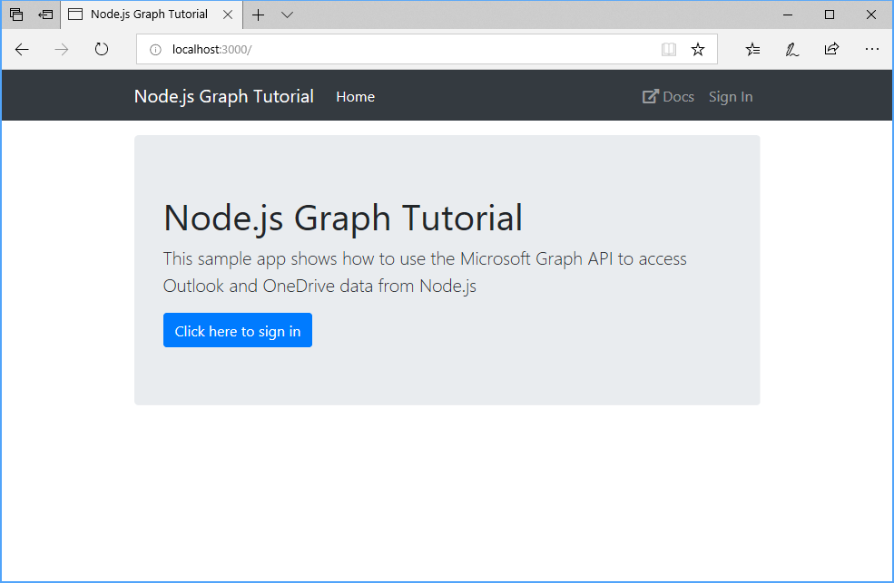

<!-- markdownlint-disable MD002 MD041 -->

Neste exercício, você usará o [Express](http://expressjs.com/) para compilar um aplicativo Web.

1. Abra sua CLI, navegue até um diretório onde você tem direitos para criar arquivos e execute o seguinte comando para criar um novo aplicativo expresso que usa o [guias](http://handlebarsjs.com/) como o mecanismo de renderização.

    ```Shell
    npx express-generator@4.16.1 --hbs graph-tutorial
    ```

    O gerador Express cria um novo diretório chamado `graph-tutorial` e estruturará um aplicativo expresso.

1. Navegue até o `graph-tutorial` diretório e digite o seguinte comando para instalar as dependências.

    ```Shell
    npm install
    ```

1. Execute o seguinte comando para atualizar pacotes de nós com vulnerabilidades relatadas.

    ```Shell
    npm audit fix
    ```

1. Execute o seguinte comando para atualizar a versão do Express e outras dependências.

    ```Shell
    npm install express@4.17.1 http-errors@1.8.0 morgan@1.10.0 debug@4.1.1
    ```

1. Use o seguinte comando para iniciar um servidor Web local.

    ```Shell
    npm start
    ```

1. Abra o navegador e vá até `http://localhost:3000`. Se tudo estiver funcionando, você verá uma mensagem de "bem-vindo ao Express". Se você não vir essa mensagem, confira o [Guia de introdução ao Express](http://expressjs.com/starter/generator.html).

## <a name="install-node-packages"></a>Instalar pacotes de nós

Antes de prosseguir, instale alguns pacotes adicionais que serão usados posteriormente:

- [dotenv](https://github.com/motdotla/dotenv) para carregar valores de um arquivo. env.
- [tempo para formatar](https://github.com/moment/moment/) valores de data/hora.
- [Windows-IANA](https://github.com/rubenillodo/windows-iana) para converter nomes de fuso horário do Windows para IDs de fuso horário da IANA.
- [Connect –](https://github.com/jaredhanson/connect-flash) mensagens de erro do flash para Flash no aplicativo.
- [Express-Session](https://github.com/expressjs/session) para armazenar valores em uma sessão do lado do servidor na memória.
- [Express-Promise-roteador](https://github.com/express-promise-router/express-promise-router) para permitir que manipuladores de rotas retornem uma promessa.
- [Express-validador](https://github.com/express-validator/express-validator) para análise e validação de dados de formulário.
- [MSAL-nó](https://github.com/AzureAD/microsoft-authentication-library-for-js/tree/dev/lib/msal-node) para autenticação e obter tokens de acesso.
- [UUID](https://github.com/uuidjs/uuid) usado pelo MSAL para gerar GUIDs.
- [Microsoft-Graph-Client](https://github.com/microsoftgraph/msgraph-sdk-javascript) para fazer chamadas para o Microsoft Graph.
- [isomorphic-FETCH](https://github.com/matthew-andrews/isomorphic-fetch) to metafill o nó de busca. Um polipreenchimento de busca é necessário para a `microsoft-graph-client` biblioteca. Consulte o [Microsoft Graph JavaScript Client library wiki](https://github.com/microsoftgraph/msgraph-sdk-javascript/wiki/Migration-from-1.x.x-to-2.x.x#polyfill-only-when-required) para obter mais informações.

1. Execute o seguinte comando em sua CLI.

    ```Shell
    npm install dotenv@8.2.0 moment@2.29.1 moment-timezone@0.5.31 connect-flash@0.1.1 express-session@1.17.1 isomorphic-fetch@3.0.0
    npm install @azure/msal-node@1.0.0-beta.0 @microsoft/microsoft-graph-client@2.1.1 windows-iana@4.2.1 express-validator@6.6.1 uuid@8.3.1
    ```

    > [!TIP]
    > Os usuários do Windows podem receber a seguinte mensagem de erro ao tentar instalar esses pacotes no Windows.
    >
    > ```Shell
    > gyp ERR! stack Error: Can't find Python executable "python", you can set the PYTHON env variable.
    > ```
    >
    > Para resolver o erro, execute o seguinte comando para instalar as ferramentas de compilação do Windows usando uma janela de terminal elevada (administrador) que instala as ferramentas de desenvolvimento do VS e o Python.
    >
    > ```Shell
    > npm install --global --production windows-build-tools
    > ```

1. Atualize o aplicativo para usar o `connect-flash` e `express-session` middleware. Abra **./app.js** e adicione a instrução a seguir `require` à parte superior do arquivo.

    ```javascript
    const session = require('express-session');
    const flash = require('connect-flash');
    const msal = require('@azure/msal-node');
    ```

1. Adicione o seguinte código imediatamente após a `var app = express();` linha.

    :::code language="javascript" source="../demo/graph-tutorial/app.js" id="SessionSnippet":::

## <a name="design-the-app"></a>Projetar o aplicativo

Nesta seção, você implementará a interface do usuário para o aplicativo.

1. Abra **./views/layout.HBS** e substitua todo o conteúdo pelo código a seguir.

    :::code language="html" source="../demo/graph-tutorial/views/layout.hbs" id="LayoutSnippet":::

    Este código adiciona a [inicialização](http://getbootstrap.com/) para estilos simples e a [fonte incrível](https://fontawesome.com/) para alguns ícones simples. Também define um layout global com uma barra de navegação.

1. Abra **./Public/stylesheets/Style.css** e substitua todo o conteúdo pelo seguinte.

    :::code language="css" source="../demo/graph-tutorial/public/stylesheets/style.css":::

1. Abra **./views/index.HBS** e substitua seu conteúdo pelo seguinte.

    :::code language="html" source="../demo/graph-tutorial/views/index.hbs" id="IndexSnippet":::

1. Abra **./routes/index.js** e substitua o código existente pelo seguinte.

    :::code language="javascript" source="../demo/graph-tutorial/routes/index.js" id="IndexRouterSnippet" highlight="6-10":::

1. Salve todas as suas alterações e reinicie o servidor. Agora, o aplicativo deve ser muito diferente.

    
