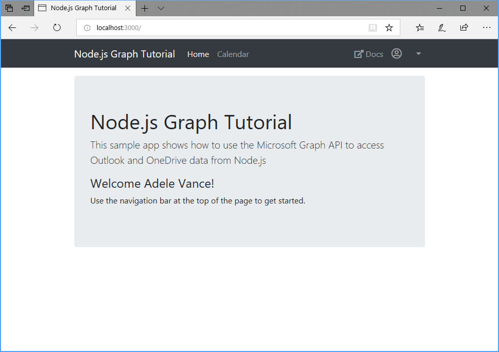
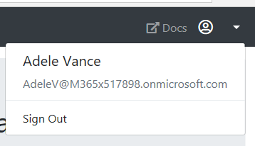

<!-- markdownlint-disable MD002 MD041 -->

<span data-ttu-id="19dec-101">Neste exercício, você estenderá o aplicativo do exercício anterior para oferecer suporte à autenticação com o Azure AD.</span><span class="sxs-lookup"><span data-stu-id="19dec-101">In this exercise you will extend the application from the previous exercise to support authentication with Azure AD.</span></span> <span data-ttu-id="19dec-102">Isso é necessário para obter o token de acesso OAuth necessário para chamar o Microsoft Graph.</span><span class="sxs-lookup"><span data-stu-id="19dec-102">This is required to obtain the necessary OAuth access token to call the Microsoft Graph.</span></span> <span data-ttu-id="19dec-103">Nesta etapa, você integrará a biblioteca de [nós MSAL](https://github.com/AzureAD/microsoft-authentication-library-for-js/tree/dev/lib/msal-node) ao aplicativo.</span><span class="sxs-lookup"><span data-stu-id="19dec-103">In this step you will integrate the [msal-node](https://github.com/AzureAD/microsoft-authentication-library-for-js/tree/dev/lib/msal-node) library into the application.</span></span>

1. <span data-ttu-id="19dec-104">Crie um novo arquivo chamado **. env** na raiz do seu aplicativo e adicione o código a seguir.</span><span class="sxs-lookup"><span data-stu-id="19dec-104">Create a new file named **.env** in the root of your application, and add the following code.</span></span>

    :::code language="ini" source="../demo/graph-tutorial/example.env":::

    <span data-ttu-id="19dec-105">Substitua `YOUR_CLIENT_SECRET_HERE` pela ID do aplicativo do portal de registro do aplicativo e substitua `YOUR_APP_SECRET_HERE` pelo segredo do cliente gerado.</span><span class="sxs-lookup"><span data-stu-id="19dec-105">Replace `YOUR_CLIENT_SECRET_HERE` with the application ID from the Application Registration Portal, and replace `YOUR_APP_SECRET_HERE` with the client secret you generated.</span></span>

    > [!IMPORTANT]
    > <span data-ttu-id="19dec-106">Se você estiver usando o controle de origem como o Git, agora seria uma boa hora para excluir o arquivo **. env** do controle de origem para evitar vazar inadvertidamente sua ID de aplicativo e sua senha.</span><span class="sxs-lookup"><span data-stu-id="19dec-106">If you're using source control such as git, now would be a good time to exclude the **.env** file from source control to avoid inadvertently leaking your app ID and password.</span></span>

1. <span data-ttu-id="19dec-107">Abra **./app.js** e adicione a seguinte linha à parte superior do arquivo para carregar o arquivo **. env** .</span><span class="sxs-lookup"><span data-stu-id="19dec-107">Open **./app.js** and add the following line to the top of the file to load the **.env** file.</span></span>

    ```javascript
    require('dotenv').config();
    ```

## <a name="implement-sign-in"></a><span data-ttu-id="19dec-108">Implementar logon</span><span class="sxs-lookup"><span data-stu-id="19dec-108">Implement sign-in</span></span>

1. <span data-ttu-id="19dec-109">Localize a linha `var indexRouter = require('./routes/index');` em **./app.js**.</span><span class="sxs-lookup"><span data-stu-id="19dec-109">Locate the line `var indexRouter = require('./routes/index');` in **./app.js**.</span></span> <span data-ttu-id="19dec-110">Insira o código a seguir **antes** dessa linha.</span><span class="sxs-lookup"><span data-stu-id="19dec-110">Insert the following code **before** that line.</span></span>

    :::code language="javascript" source="../demo/graph-tutorial/app.js" id="MsalInitSnippet":::

    <span data-ttu-id="19dec-111">Este código inicializa a biblioteca MSAL com a ID do aplicativo e a senha do aplicativo.</span><span class="sxs-lookup"><span data-stu-id="19dec-111">This code initializes the msal-node library with the app ID and password for the app.</span></span>

1. <span data-ttu-id="19dec-112">Crie um novo arquivo no diretório **./routes** chamado **auth.js** e adicione o código a seguir.</span><span class="sxs-lookup"><span data-stu-id="19dec-112">Create a new file in the **./routes** directory named **auth.js** and add the following code.</span></span>

    ```javascript
    var router = require('express-promise-router')();

    /* GET auth callback. */
    router.get('/signin',
      async function (req, res) {
        const urlParameters = {
          scopes: process.env.OAUTH_SCOPES.split(','),
          redirectUri: process.env.OAUTH_REDIRECT_URI
        };

        try {
          const authUrl = await req.app.locals
            .msalClient.getAuthCodeUrl(urlParameters);
          res.redirect(authUrl);
        }
        catch (error) {
          console.log(`Error: ${error}`);
          req.flash('error_msg', {
            message: 'Error getting auth URL',
            debug: JSON.stringify(error, Object.getOwnPropertyNames(error))
          });
          res.redirect('/');
        }
      }
    );

    router.get('/callback',
      async function(req, res) {
        const tokenRequest = {
          code: req.query.code,
          scopes: process.env.OAUTH_SCOPES.split(','),
          redirectUri: process.env.OAUTH_REDIRECT_URI
        };

        try {
          const response = await req.app.locals
            .msalClient.acquireTokenByCode(tokenRequest);

          // TEMPORARY!
          // Flash the access token for testing purposes
          req.flash('error_msg', {
            message: 'Access token',
            debug: response.accessToken
          });
        } catch (error) {
          req.flash('error_msg', {
            message: 'Error completing authentication',
            debug: JSON.stringify(error, Object.getOwnPropertyNames(error))
          });
        }

        res.redirect('/');
      }
    );

    router.get('/signout',
      async function(req, res) {
        // Sign out
        if (req.session.userId) {
          // Look up the user's account in the cache
          const accounts = await req.app.locals.msalClient
            .getTokenCache()
            .getAllAccounts();

          const userAccount = accounts.find(a => a.homeAccountId === req.session.userId);

          // Remove the account
          if (userAccount) {
            req.app.locals.msalClient
              .getTokenCache()
              .removeAccount(userAccount);
          }
        }

        // Destroy the user's session
        req.session.destroy(function (err) {
          res.redirect('/');
        });
      }
    );

    module.exports = router;
    ```

    <span data-ttu-id="19dec-113">Isso define um roteador com três rotas: `signin` , `callback` e `signout` .</span><span class="sxs-lookup"><span data-stu-id="19dec-113">This defines a router with three routes: `signin`, `callback`, and `signout`.</span></span>

    <span data-ttu-id="19dec-114">A `signin` rota chama a `getAuthCodeUrl` função para gerar a URL de logon e redireciona o navegador para essa URL.</span><span class="sxs-lookup"><span data-stu-id="19dec-114">The `signin` route calls the `getAuthCodeUrl` function to generate the login URL, then redirects the browser to that URL.</span></span>

    <span data-ttu-id="19dec-115">A `callback` rota é onde o Azure é redirecionado após a conclusão da entrada.</span><span class="sxs-lookup"><span data-stu-id="19dec-115">The `callback` route is where Azure redirects after the signin is complete.</span></span> <span data-ttu-id="19dec-116">O código chama a `acquireTokenByCode` função para trocar o código de autorização para um token de acesso.</span><span class="sxs-lookup"><span data-stu-id="19dec-116">The code calls the `acquireTokenByCode` function to exchange the authorization code for an access token.</span></span> <span data-ttu-id="19dec-117">Após o token ser obtido, ele redireciona de volta para a Home Page com o token de acesso no valor de erro temporário.</span><span class="sxs-lookup"><span data-stu-id="19dec-117">Once the token is obtained, it redirects back to the home page with the access token in the temporary error value.</span></span> <span data-ttu-id="19dec-118">Usaremos isso para verificar se a entrada está funcionando antes de prosseguir.</span><span class="sxs-lookup"><span data-stu-id="19dec-118">We'll use this to verify that our sign-in is working before moving on.</span></span> <span data-ttu-id="19dec-119">Antes de testar, precisamos configurar o aplicativo expresso para usar o novo roteador de **./routes/auth.js**.</span><span class="sxs-lookup"><span data-stu-id="19dec-119">Before we test, we need to configure the Express app to use the new router from **./routes/auth.js**.</span></span>

    <span data-ttu-id="19dec-120">O `signout` método registra o usuário e destrói a sessão.</span><span class="sxs-lookup"><span data-stu-id="19dec-120">The `signout` method logs the user out and destroys the session.</span></span>

1. <span data-ttu-id="19dec-121">Abra **./app.js** e insira o código a seguir **antes** da `var app = express();` linha.</span><span class="sxs-lookup"><span data-stu-id="19dec-121">Open **./app.js** and insert the following code **before** the `var app = express();` line.</span></span>

    ```javascript
    var authRouter = require('./routes/auth');
    ```

1. <span data-ttu-id="19dec-122">Insira o código a seguir **após** a `app.use('/', indexRouter);` linha.</span><span class="sxs-lookup"><span data-stu-id="19dec-122">Insert the following code **after** the `app.use('/', indexRouter);` line.</span></span>

    ```javascript
    app.use('/auth', authRouter);
    ```

<span data-ttu-id="19dec-123">Inicie o servidor e navegue até `https://localhost:3000` .</span><span class="sxs-lookup"><span data-stu-id="19dec-123">Start the server and browse to `https://localhost:3000`.</span></span> <span data-ttu-id="19dec-124">Clique no botão entrar e você deverá ser redirecionado para o `https://login.microsoftonline.com` .</span><span class="sxs-lookup"><span data-stu-id="19dec-124">Click the sign-in button and you should be redirected to `https://login.microsoftonline.com`.</span></span> <span data-ttu-id="19dec-125">Faça logon com sua conta da Microsoft e concorde com as permissões solicitadas.</span><span class="sxs-lookup"><span data-stu-id="19dec-125">Login with your Microsoft account and consent to the requested permissions.</span></span> <span data-ttu-id="19dec-126">O navegador redireciona para o aplicativo, mostrando o token.</span><span class="sxs-lookup"><span data-stu-id="19dec-126">The browser redirects to the app, showing the token.</span></span>

### <a name="get-user-details"></a><span data-ttu-id="19dec-127">Obter detalhes do usuário</span><span class="sxs-lookup"><span data-stu-id="19dec-127">Get user details</span></span>

1. <span data-ttu-id="19dec-128">Crie um novo arquivo na raiz do projeto chamado **graph.js** e adicione o código a seguir.</span><span class="sxs-lookup"><span data-stu-id="19dec-128">Create a new file in the root of the project named **graph.js** and add the following code.</span></span>

    ```javascript
    var graph = require('@microsoft/microsoft-graph-client');
    require('isomorphic-fetch');

    module.exports = {
      getUserDetails: async function(accessToken) {
        const client = getAuthenticatedClient(accessToken);

        const user = await client
          .api('/me')
          .select('displayName,mail,mailboxSettings,userPrincipalName')
          .get();
        return user;
      },
    };

    function getAuthenticatedClient(accessToken) {
      // Initialize Graph client
      const client = graph.Client.init({
        // Use the provided access token to authenticate
        // requests
        authProvider: (done) => {
          done(null, accessToken);
        }
      });

      return client;
    }
    ```

    <span data-ttu-id="19dec-129">Isso exporta a `getUserDetails` função, que usa o SDK do Microsoft Graph para chamar o `/me` ponto de extremidade e retornar o resultado.</span><span class="sxs-lookup"><span data-stu-id="19dec-129">This exports the `getUserDetails` function, which uses the Microsoft Graph SDK to call the `/me` endpoint and return the result.</span></span>

1. <span data-ttu-id="19dec-130">Abra **./routes/auth.js** e adicione as seguintes `require` instruções à parte superior do arquivo.</span><span class="sxs-lookup"><span data-stu-id="19dec-130">Open **./routes/auth.js** and add the following `require` statements to the top of the file.</span></span>

    ```javascript
    var graph = require('../graph');
    ```

1. <span data-ttu-id="19dec-131">Substitua a rota de retorno de chamada existente pelo código a seguir.</span><span class="sxs-lookup"><span data-stu-id="19dec-131">Replace the existing callback route with the following code.</span></span>

    :::code language="javascript" source="../demo/graph-tutorial/routes/auth.js" id="CallbackSnippet" highlight="13-23":::

    <span data-ttu-id="19dec-132">O novo código salva a ID da conta do usuário na sessão, obtém os detalhes do usuário do Microsoft Graph e o salva no armazenamento do usuário do aplicativo.</span><span class="sxs-lookup"><span data-stu-id="19dec-132">The new code saves the user's account ID in the session, gets the user's details from Microsoft Graph, and saves it in the app's user storage.</span></span>

1. <span data-ttu-id="19dec-133">Reinicie o servidor e vá pelo processo de entrada.</span><span class="sxs-lookup"><span data-stu-id="19dec-133">Restart the server and go through the sign-in process.</span></span> <span data-ttu-id="19dec-134">Você deve terminar de volta na Home Page, mas a interface do usuário deve ser alterada para indicar que você está conectado.</span><span class="sxs-lookup"><span data-stu-id="19dec-134">You should end up back on the home page, but the UI should change to indicate that you are signed-in.</span></span>

    

1. <span data-ttu-id="19dec-136">Clique no avatar do usuário no canto superior direito para **acessar o link sair.**</span><span class="sxs-lookup"><span data-stu-id="19dec-136">Click the user avatar in the top right corner to access the **Sign Out** link.</span></span> <span data-ttu-id="19dec-137">Clicar **em sair** redefine a sessão e retorna à Home Page.</span><span class="sxs-lookup"><span data-stu-id="19dec-137">Clicking **Sign Out** resets the session and returns you to the home page.</span></span>

    

## <a name="storing-and-refreshing-tokens"></a><span data-ttu-id="19dec-139">Armazenar e atualizar tokens</span><span class="sxs-lookup"><span data-stu-id="19dec-139">Storing and refreshing tokens</span></span>

<span data-ttu-id="19dec-140">Nesse ponto, seu aplicativo tem um token de acesso, que é enviado no `Authorization` cabeçalho das chamadas de API.</span><span class="sxs-lookup"><span data-stu-id="19dec-140">At this point your application has an access token, which is sent in the `Authorization` header of API calls.</span></span> <span data-ttu-id="19dec-141">Este é o token que permite que o aplicativo acesse o Microsoft Graph em nome do usuário.</span><span class="sxs-lookup"><span data-stu-id="19dec-141">This is the token that allows the app to access the Microsoft Graph on the user's behalf.</span></span>

<span data-ttu-id="19dec-142">No entanto, esse token é de vida curta.</span><span class="sxs-lookup"><span data-stu-id="19dec-142">However, this token is short-lived.</span></span> <span data-ttu-id="19dec-143">O token expira uma hora após sua emissão.</span><span class="sxs-lookup"><span data-stu-id="19dec-143">The token expires an hour after it is issued.</span></span> <span data-ttu-id="19dec-144">É onde o token de atualização se torna útil.</span><span class="sxs-lookup"><span data-stu-id="19dec-144">This is where the refresh token becomes useful.</span></span> <span data-ttu-id="19dec-145">A especificação OAuth introduz um token de atualização, que permite ao aplicativo solicitar um novo token de acesso sem exigir que o usuário entre novamente.</span><span class="sxs-lookup"><span data-stu-id="19dec-145">The OAuth specification introduces a refresh token, which allows the app to request a new access token without requiring the user to sign in again.</span></span>

<span data-ttu-id="19dec-146">Como o aplicativo está usando o pacote MSAL, você não precisa implementar qualquer lógica de armazenamento ou de atualização.</span><span class="sxs-lookup"><span data-stu-id="19dec-146">Because the app is using the msal-node package, you do not need to implement any token storage or refresh logic.</span></span> <span data-ttu-id="19dec-147">O aplicativo usa o cache de token de MSAL no nó padrão, que é suficiente para um aplicativo de exemplo.</span><span class="sxs-lookup"><span data-stu-id="19dec-147">The app uses the default msal-node in-memory token cache, which is sufficient for a sample application.</span></span> <span data-ttu-id="19dec-148">Os aplicativos de produção devem fornecer seus próprios [plug-ins de cache](https://github.com/AzureAD/microsoft-authentication-library-for-js/blob/dev/lib/msal-node/docs/configuration.md) para serializar o cache de token em uma mídia de armazenamento segura e confiável.</span><span class="sxs-lookup"><span data-stu-id="19dec-148">Production applications should provide their own [caching plugin](https://github.com/AzureAD/microsoft-authentication-library-for-js/blob/dev/lib/msal-node/docs/configuration.md) to serialize the token cache in a secure, reliable storage medium.</span></span>
