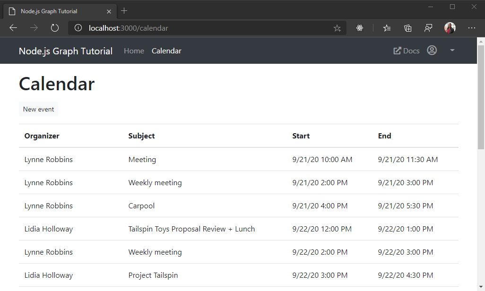

<!-- markdownlint-disable MD002 MD041 -->

Neste exercício, você incorporará o Microsoft Graph no aplicativo. Para este aplicativo, você usará a biblioteca [Microsoft-Graph-Client](https://github.com/microsoftgraph/msgraph-sdk-javascript) para fazer chamadas para o Microsoft Graph.

## <a name="get-calendar-events-from-outlook"></a>Obter eventos de calendário do Outlook

Comece adicionando um novo método ao `./graph.js` arquivo para obter os eventos do calendário. Adicione a seguinte função dentro do `module.exports` no `./graph.js`.

```js
getEvents: async function(accessToken) {
  const client = getAuthenticatedClient(accessToken);

  const events = await client
    .api('/me/events')
    .select('subject,organizer,start,end')
    .orderby('createdDateTime DESC')
    .get();

  return events;
}
```

Considere o que esse código está fazendo.

- A URL que será chamada é `/me/events`.
- O `select` método limita os campos retornados para cada evento para apenas aqueles que o modo de exibição realmente usará.
- O `orderby` método classifica os resultados pela data e hora em que foram criados, com o item mais recente em primeiro lugar.

Crie um novo arquivo no `./routes` diretório chamado `calendar.js`e adicione o código a seguir.

```js
var express = require('express');
var router = express.Router();
var tokens = require('../tokens.js');
var graph = require('../graph.js');

/* GET /calendar */
router.get('/',
  async function(req, res) {
    if (!req.isAuthenticated()) {
      // Redirect unauthenticated requests to home page
      res.redirect('/')
    } else {
      let params = {
        active: { calendar: true }
      };

      // Get the access token
      var accessToken;
      try {
        accessToken = await tokens.getAccessToken(req);
      } catch (err) {
        res.json(err);
      }

      if (accessToken && accessToken.length > 0) {
        try {
          // Get the events
          var events = await graph.getEvents(accessToken);

          res.json(events.value);
        } catch (err) {
          res.json(err);
        }
      }
    }
  }
);

module.exports = router;
```

Atualize `./app.js` para usar essa nova rota. Adicione a seguinte linha **antes** da `var app = express();` linha.

```js
var calendarRouter = require('./routes/calendar');
```

Em seguida, adicione a **** linha a `app.use('/auth', authRouter);` seguir após a linha.

```js
app.use('/calendar', calendarRouter);
```

Agora você pode testar isso. Entre e clique no link **calendário** na barra de navegação. Se tudo funcionar, você deverá ver um despejo JSON de eventos no calendário do usuário.

## <a name="display-the-results"></a>Exibir os resultados

Agora você pode adicionar um modo de exibição para exibir os resultados de forma mais amigável. Primeiro, adicione o código a seguir `./app.js` em **após** a `app.set('view engine', 'hbs');` linha.

```js
var hbs = require('hbs');
var moment = require('moment');
// Helper to format date/time sent by Graph
hbs.registerHelper('eventDateTime', function(dateTime){
  return moment(dateTime).format('M/D/YY h:mm A');
});
```

Isso implementa um [auxiliar guias](http://handlebarsjs.com/#helpers) para formatar a data ISO 8601 retornada pelo Microsoft Graph em algo mais amigável.

Crie um novo arquivo no `./views` diretório chamado `calendar.hbs` e adicione o código a seguir.

```html
<h1>Calendar</h1>
<table class="table">
  <thead>
    <tr>
      <th scope="col">Organizer</th>
      <th scope="col">Subject</th>
      <th scope="col">Start</th>
      <th scope="col">End</th>
    </tr>
  </thead>
  <tbody>
    {{#each events}}
      <tr>
        <td>{{this.organizer.emailAddress.name}}</td>
        <td>{{this.subject}}</td>
        <td>{{eventDateTime this.start.dateTime}}</td>
        <td>{{eventDateTime this.end.dateTime}}</td>
      </tr>
    {{/each}}
  </tbody>
</table>
```

Isso executará um loop através de uma coleção de eventos e adicionará uma linha de tabela para cada um. Agora atualize a rota `./routes/calendar.js` para usar este modo de exibição. Substitua a rota existente pelo código a seguir.

```js
router.get('/',
  async function(req, res) {
    if (!req.isAuthenticated()) {
      // Redirect unauthenticated requests to home page
      res.redirect('/')
    } else {
      let params = {
        active: { calendar: true }
      };

      // Get the access token
      var accessToken;
      try {
        accessToken = await tokens.getAccessToken(req);
      } catch (err) {
        req.flash('error_msg', {
          message: 'Could not get access token. Try signing out and signing in again.',
          debug: JSON.stringify(err)
        });
      }

      if (accessToken && accessToken.length > 0) {
        try {
          // Get the events
          var events = await graph.getEvents(accessToken);
          params.events = events.value;
        } catch (err) {
          req.flash('error_msg', {
            message: 'Could not fetch events',
            debug: JSON.stringify(err)
          });
        }
      }

      res.render('calendar', params);
    }
  }
);
```

Salve suas alterações, reinicie o servidor e entre no aplicativo. Clique no link do **calendário** e o aplicativo agora deve renderizar uma tabela de eventos.


