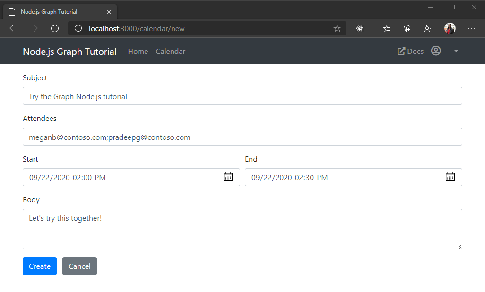

<!-- markdownlint-disable MD002 MD041 -->

Nesta seção, você adicionará a capacidade de criar eventos no calendário do usuário.In this section you will add the ability to create events on the user's calendar.

## Criar um novo formulário de eventosCreate a new event form

1. Crie um novo arquivo no diretório **./views** chamado **NewEvent. HBS** e adicione o código a seguir.Create a new file in the **./views** directory named **newevent.hbs** and add the following code.

    :::code language="html" source="../demo/graph-tutorial/views/newevent.hbs" id="NewEventFormSnippet":::

1. Adicione o código a seguir ao arquivo **./routes/calendar.js** antes da `module.exports = router;` linha.Add the following code to the **./routes/calendar.js** file before the `module.exports = router;` line.

    :::code language="javascript" source="../demo/graph-tutorial/routes/calendar.js" id="GetEventFormSnippet":::

Isso implementa um formulário para entrada do usuário e o renderiza.This implements a form for user input and renders it.

## Criar o eventoCreate the event

1. Abra **./graph.js** e adicione a seguinte função dentro do `module.exports` .Open **./graph.js** and add the following function inside `module.exports`.

    :::code language="javascript" source="../demo/graph-tutorial/graph.js" id="CreateEventSnippet":::

    Este código usa os campos de formulário para criar um objeto de evento de gráfico e, em seguida, envia uma solicitação POST ao `/me/events` ponto de extremidade para criar o evento no calendário padrão do usuário.This code uses the form fields to create a Graph event object, then sends a POST request to the `/me/events` endpoint to create the event on the user's default calendar.

1. Adicione o código a seguir ao arquivo **./routes/calendar.js** antes da `module.exports = router;` linha.Add the following code to the **./routes/calendar.js** file before the `module.exports = router;` line.

    :::code language="javascript" source="../demo/graph-tutorial/routes/calendar.js" id="PostEventFormSnippet":::

    Este código valida e limpou a entrada do formulário e, em seguida, chama `graph.createEvent` para criar o evento.This code validates and sanitized the form input, then calls `graph.createEvent` to create the event. Ele redireciona de volta para o modo de exibição calendário após a chamada ser concluída.It redirects back to the calendar view after the call completes.

1. Salve suas alterações e reinicie o aplicativo.Save your changes and restart the app. Clique no item de navegação **calendário** e, em seguida, clique no botão **criar evento** .Click the **Calendar** nav item, then click the **Create event** button. Preencha os valores e clique em **criar**.Fill in the values and click **Create**. O aplicativo retorna para o modo de exibição calendário depois que o novo evento é criado.The app returns to the calendar view once the new event is created.

    
