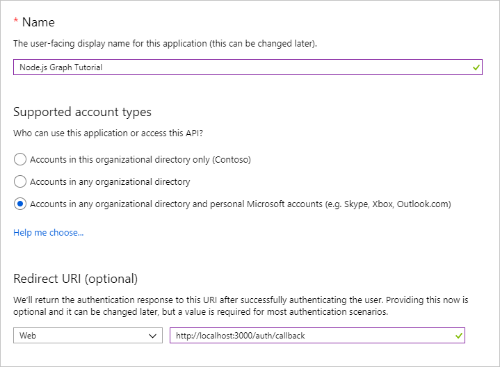
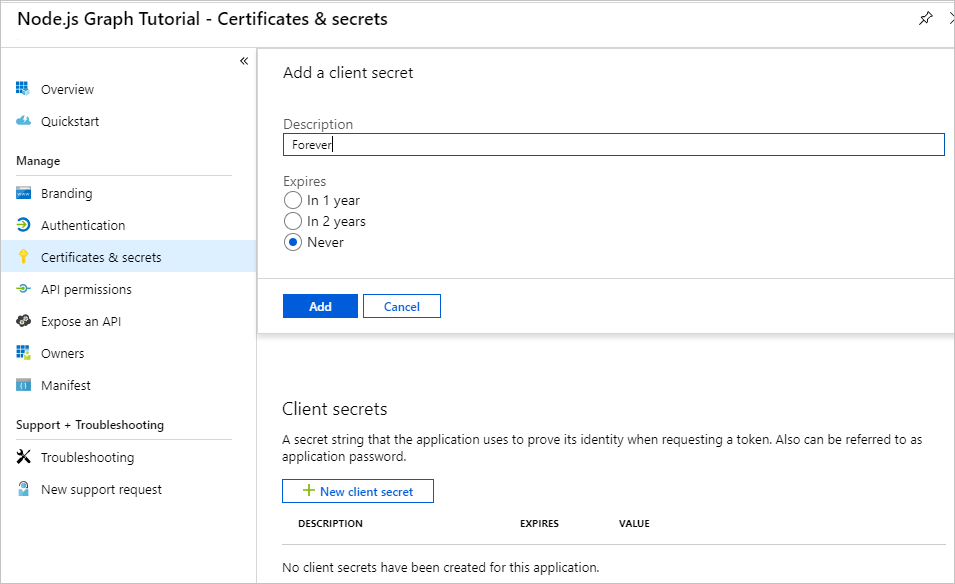

<!-- markdownlint-disable MD002 MD041 -->

Neste exercício, você criará um novo registro de aplicativo Web do Azure AD usando o centro de administração do Azure Active Directory.In this exercise, you will create a new Azure AD web application registration using the Azure Active Directory admin center.

1. Abra um navegador e navegue até o [centro de administração do Azure Active Directory](https://aad.portal.azure.com).Open a browser and navigate to the [Azure Active Directory admin center](https://aad.portal.azure.com). Faça logon usando uma **conta pessoal** (também conhecida como Conta da Microsoft) ou **Conta Corporativa ou de Estudante**.Login using a **personal account** (aka: Microsoft Account) or **Work or School Account**.

1. Selecione **Azure Active Directory** na navegação à esquerda e, em seguida, selecione **registros de aplicativo** em **gerenciar**.Select **Azure Active Directory** in the left-hand navigation, then select **App registrations** under **Manage**.

    

1. Selecione **Novo registro**.Select **New registration**. Na página **Registrar um aplicativo**, defina os valores da seguinte forma.On the **Register an application** page, set the values as follows.

    - Defina **Nome** para `Node.js Graph Tutorial`.Set **Name** to `Node.js Graph Tutorial`.
    - Defina **Tipos de conta com suporte** para **Contas em qualquer diretório organizacional e contas pessoais da Microsoft**.Set **Supported account types** to **Accounts in any organizational directory and personal Microsoft accounts**.
    - Em **URI de Redirecionamento**, defina o primeiro menu suspenso para `Web` e defina o valor como `http://localhost:3000/auth/callback`.Under **Redirect URI**, set the first drop-down to `Web` and set the value to `http://localhost:3000/auth/callback`.

    

1. Escolha **Registrar**.Choose **Register**. Na página **tutorial do gráfico node. js** , copie o valor da **ID do aplicativo (cliente)** e salve-o, você precisará dele na próxima etapa.On the **Node.js Graph Tutorial** page, copy the value of the **Application (client) ID** and save it, you will need it in the next step.

    

1. Selecione **Autenticação** em **Gerenciar**.Select **Authentication** under **Manage**. Localize a seção **Concessão Implícita** e habilite **tokens de ID**.Locate the **Implicit grant** section and enable **ID tokens**. Escolha **Salvar**.Choose **Save**.

    

1. Selecione **Certificados e segredos** sob **Gerenciar**.Select **Certificates & secrets** under **Manage**. Selecione o botão **Novo segredo do cliente**.Select the **New client secret** button. Insira um valor em **Descrição**, selecione uma das opções para **Expira** e escolha **Adicionar**.Enter a value in **Description** and select one of the options for **Expires** and choose **Add**.

    

1. Copie o valor secreto do cliente antes de sair desta página.Copy the client secret value before you leave this page. Você precisará dele na próxima etapa.You will need it in the next step.

    > [!IMPORTANT]
    > Este segredo do cliente nunca é mostrado novamente, portanto, copie-o agora.This client secret is never shown again, so make sure you copy it now.

    